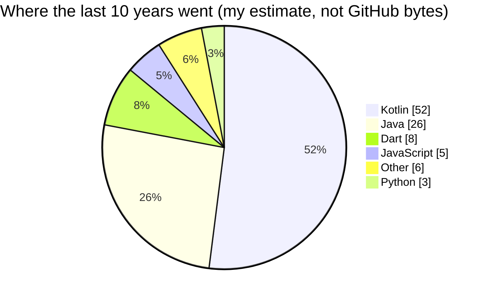

[**singgihsaputro.github.io**](https://singgihsaputro.github.io) &nbsp;·&nbsp;
[LinkedIn](https://www.linkedin.com/in/singgihrs/) &nbsp;·&nbsp;
[singgih.rochmad@gmail.com](mailto:singgih.rochmad@gmail.com)

## About

Senior Android Engineer with **10 years** building consumer and merchant apps at
Indonesia's largest technology companies, including products with **100M+ downloads**.
Recent focus on server-driven UI, anti-fraud and KYC integration, and app size and
performance optimization. I lead cross-team delivery and mentor senior engineers.

| | | |
|---|---|---|
| **10 yrs** building Android | **100M+** downloads on apps shipped | **1st / 74** GoTo Hackathon 2025 |

## Tech Stack

**Mobile**

      

**Architecture & Libraries**

    

**Backend & Web**

    

## Language mix

Most of this lives in private repositories, so this account's public language stats
do not tell the story — they are dominated by vendored files in old web projects.

## Shipped

| App | Reach | Stack |
|---|---|---|
| [GoFood Merchant (GoBiz)](https://play.google.com/store/apps/details?id=com.gojek.resto) | 5M+ · 4.1★ | Kotlin, Jetpack Compose, MVVM/MVI, multi-module, Room, Retrofit |
| [Gojek](https://play.google.com/store/apps/details?id=com.gojek.app) | 100M+ · 4.7★ | Kotlin, Jetpack Compose, clean architecture, coroutines, Flow |
| [GoPay](https://play.google.com/store/apps/details?id=com.gojek.gopay) | 100M+ · 4.7★ | Flutter, Dart, MVVM, multi-module, clean architecture |
| [TIX ID](https://play.google.com/store/apps/details?id=id.tix.android) | 10M+ · 4.8★ | Kotlin, Java, Room, RxJava2, Dagger2, MVP |
| [DANA](https://play.google.com/store/apps/details?id=id.dana) | 100M+ · 4.7★ | Java, Room, RxJava2, Dagger2, Retrofit, MVP |
| PayPro | Indosat, white-label | Java, RxJava, Dagger2, Retrofit, MVP |

## Experience

**Gojek (GoTo)** · Senior Software Engineer, Android · Nov 2019 – present

- Replaced release-gated layout changes with **server-driven UI** — campaigns now ship as configuration.
- Built a self-serve bank account flow with real-time FRS risk checks, removing **3,000 manual tickets a month**.
- Shipped a reusable feedback module that collected **56,290 responses** at 4.65/5.
- Led MVI adoption and the ViewBinding migration; split Help Center and Onboarding into separate modules.
- Cut **~10MB** off the APK through rebranding cleanup, POS build optimization and legacy removal.
- Onboarded 3 senior Android engineers; ran interview panels and sprint capacity planning.

**Kemendikbudristek** · Practitioner Lecturer · 2022 – 2025 — taught Android and Flutter at 5 universities.

**DANA** · Senior Software Engineer · Jul 2017 – Oct 2019 — led a 3-person offshore team on TIX ID,
integrated Alicloud CDN for ~20% better image load efficiency, mentored 2 engineers.

**Ice House** · Software Engineer · Oct 2016 – Jun 2017 — built PayPro end-to-end for Indosat.

## Awards

- **Champion, GoTo Hackathon 2025** — 1st of 74 teams across Indonesia, India, Singapore and China.
- 2nd Winner, Hackathon Google Indonesia Android Kejar (2016)
- 1st Winner, Inovasi Teknologi East Java, IT Category (2015)
- Winner, Mobile Apps Development Competition, Gadjah Mada University (2014)
- Finalist & Best Category, "World Citizenship" IDTECH, Microsoft (2014)

## Education

**University of Indonesia** — Master of Information Technology, GPA 3.42 (2023 – 2026)

**Brawijaya University** — Bachelor of Computer Science, GPA 3.53 (2011 – 2016)

## Stats

Open to senior and lead Android roles.
Full CV at [**singgihsaputro.github.io**](https://singgihsaputro.github.io).

