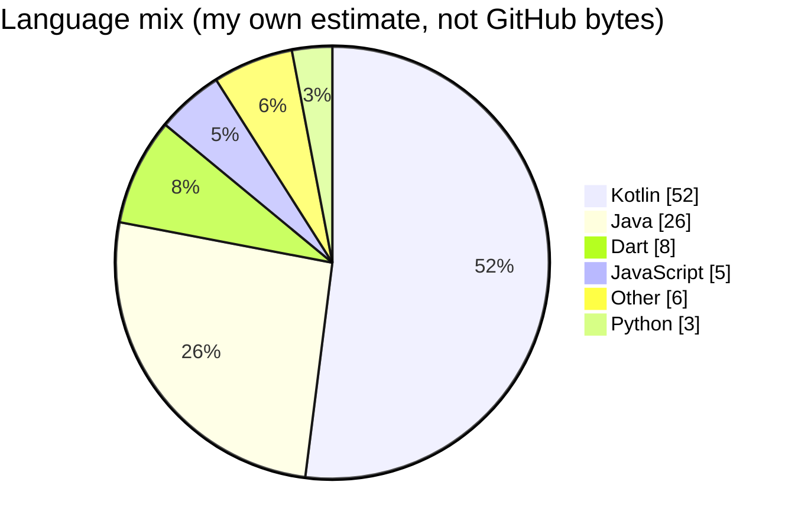

## Singgih Rochmad Saputro

**Senior Android Engineer** · Jakarta, Indonesia · [Gojek (GoTo)](https://www.gojek.com)

10 years building consumer and merchant apps at Indonesia's largest technology
companies, including products with 100M+ downloads. Currently working on
server-driven UI, anti-fraud and KYC integration, and app size and performance.

[**singgihsaputro.github.io**](https://singgihsaputro.github.io) ·
[LinkedIn](https://www.linkedin.com/in/singgihrs/) ·
[singgih.rochmad@gmail.com](mailto:singgih.rochmad@gmail.com)

---

### Where the last 10 years went

Most of this lives in private repositories, so the public language stats on this
account do not tell the story — they are dominated by vendored files in old web projects.

### Shipped

| App | Reach | Stack |
|---|---|---|
| [GoFood Merchant (GoBiz)](https://play.google.com/store/apps/details?id=com.gojek.resto) | 5M+ · 4.1★ | Kotlin, Compose, MVVM/MVI, multi-module |
| [Gojek](https://play.google.com/store/apps/details?id=com.gojek.app) | 100M+ · 4.7★ | Kotlin, Compose, clean architecture |
| [GoPay](https://play.google.com/store/apps/details?id=com.gojek.gopay) | 100M+ · 4.7★ | Kotlin, Compose, coroutines, Flow |
| [TIX ID](https://play.google.com/store/apps/details?id=id.tix.android) | 10M+ · 4.8★ | Kotlin, Java, RxJava2, Dagger2 |
| [DANA](https://play.google.com/store/apps/details?id=id.dana) | 100M+ · 4.7★ | Java, RxJava2, Dagger2, MVP |

### A few things I have done

- Replaced release-gated layout changes with **server-driven UI** — campaigns now ship as configuration.
- Built a self-serve bank account flow with real-time risk checks, removing **3,000 manual tickets a month**.
- Cut **~10MB** off an APK through rebranding cleanup, build optimization, and legacy removal.
- Shipped a feedback module that collected **56,290 responses** at 4.65/5.
- **Champion, GoTo Hackathon 2025** — 1st of 74 teams across Indonesia, India, Singapore and China.
- Taught Android and Flutter at 5 universities as a practitioner lecturer for Kemendikbudristek.

### Also

Kotlin Multiplatform, Flutter, and the occasional Node experiment — pinned below.
Open to senior and lead Android roles.
